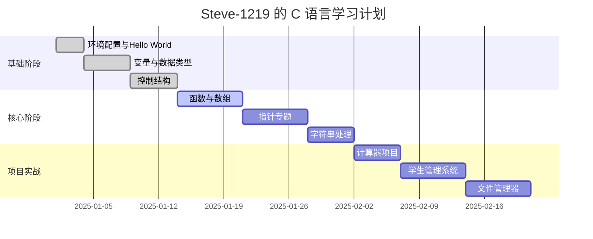

# 🎯 C 语言编程入门 - Steve-1219 的学习仓库


> 一个完整的 C 语言学习项目，包含教程、示例、练习和实战项目。由 Steve-1219 创建和维护。

## ✨ 项目亮点

- ✅ **系统学习** - 从零开始的完整学习路径
- ✅ **丰富示例** - 100+ 个实用代码示例
- ✅ **互动练习** - 分级练习题和答案
- ✅ **实战项目** - 从简单到复杂的完整项目
- ✅ **详细文档** - 速查表、常见错误、学习资源

---

## 🚀 快速开始（5分钟内）

### 1. 获取代码
```bash
# 克隆项目
git clone https://github.com/Steve-1219/c-learning.git

# 进入项目目录
cd c-learning
```

### 2. 运行第一个程序
```bash
# 进入基础示例目录
cd src/basics

# 编译运行 Hello World
gcc hello-world.c -o hello
./hello
```

### 3. 查看输出
```
Hello, C World!
Welcome to Steve-1219's C Learning Project!
```

## 📁 项目结构概览

```
c-learning/
├── 📄 README.md                    # 你现在阅读的文件
├── ⚙️ setup-guide.md              # 🔧 环境配置指南
│
├── 📂 src/                         # 💾 源代码目录
│   ├── basics/                    # 🅰️ 基础语法示例
│   ├── functions/                 # 🔢 函数相关
│   ├── pointers/                  # 🎯 指针专题
│   └── advanced/                  # ⚡ 高级主题
│
├── 📂 projects/                    # 🛠️ 实战项目
│   ├── calculator/               # 🧮 计算器程序
│   ├── student-system/           # 🎓 学生管理系统
│   └── file-manager/             # 📁 文件管理器
│
├── 📂 exercises/                   # 📚 练习题
│   ├── beginner/                 # 🟢 初级练习
│   ├── intermediate/             # 🟡 中级练习
│   └── solutions/                # 📋 参考答案
│
├── 📂 docs/                        # 📖 文档资料
│   ├── c-cheatsheet.md           # 📋 C语言速查表
│   ├── common-errors.md          # ⚠️ 常见错误
│   └── resources.md              # 🔗 学习资源
│
├── 🔧 .gitignore                  # Git忽略文件
└── 📄 LICENSE                     # 许可证文件
```

---

## 📚 学习路线图

### 🟢 第一阶段：基础入门（第1-2周）
- ✅ 环境配置与第一个程序
- ✅ 变量、数据类型、运算符
- ✅ 输入输出函数
- ✅ 条件语句与循环

### 🟡 第二阶段：核心概念（第3-4周）
- 🔄 函数与作用域
- 🔄 数组与字符串
- 🔄 指针基础
- 🔄 结构体与联合体

### 🔵 第三阶段：高级主题（第5-6周）
- ⏳ 动态内存管理
- ⏳ 文件操作
- ⏳ 预处理器
- ⏳ 多文件编程

### 🟣 第四阶段：项目实战（第7-8周）
- ⏳ 综合项目开发
- ⏳ 代码优化与调试
- ⏳ 项目文档编写

---

## 💡 特色示例

### 1. 基础输入输出
```c
// src/basics/io-example.c
#include <stdio.h>

int main() {
    char name[50];
    int age;
    
    printf("请输入你的名字: ");
    scanf("%s", name);
    
    printf("请输入年龄: ");
    scanf("%d", &age);
    
    printf("\n👋 你好 %s！\n", name);
    printf("🎂 你今年 %d 岁\n", age);
    
    return 0;
}
```

### 2. 指针理解
```c
// src/pointers/basic-pointer.c
#include <stdio.h>

int main() {
    int number = 42;
    int *ptr = &number;
    
    printf("变量值: %d\n", number);
    printf("变量地址: %p\n", &number);
    printf("指针值: %p\n", ptr);
    printf("指针指向的值: %d\n", *ptr);
    
    return 0;
}
```

### 3. 文件操作示例
```c
// src/advanced/file-example.c
#include <stdio.h>

int main() {
    FILE *file;
    
    // 写入文件
    file = fopen("data.txt", "w");
    if (file != NULL) {
        fprintf(file, "C语言学习笔记\n");
        fprintf(file, "作者: Steve-1219\n");
        fclose(file);
    }
    
    // 读取文件
    char line[100];
    file = fopen("data.txt", "r");
    if (file != NULL) {
        printf("文件内容:\n");
        while (fgets(line, sizeof(line), file)) {
            printf("%s", line);
        }
        fclose(file);
    }
    
    return 0;
}
```

---

## 🛠️ 开发工具推荐

### 编辑器/IDE
| 工具 | 适用场景 | 推荐理由 |
|------|---------|---------|
| **VS Code** | 初学者/进阶 | 轻量、插件丰富、跨平台 |
| **Code::Blocks** | 初学者 | 专为C/C++设计、简单易用 |
| **CLion** | 专业开发 | 功能强大、智能提示 |
| **Vim/Neovim** | 高手向 | 高效、可定制 |

### 在线编译器
- 🌐 [OnlineGDB](https://www.onlinegdb.com/) - 支持调试的在线编译器
- 🌐 [Replit](https://replit.com/) - 完整的在线开发环境
- 🌐 [Compiler Explorer](https://godbolt.org/) - 查看汇编代码

---

## 📖 详细文档索引

| 文档 | 说明 | 链接 |
|------|------|------|
| ⚙️ **环境配置** | 详细的安装配置指南 | [setup-guide.md](setup-guide.md) ||
| 📋 **速查表** | C语言语法速查 | [docs/c-cheatsheet.md](docs/c-cheatsheet.md) |
| ⚠️ **常见错误** | 新手常见错误及解决 | [docs/common-errors.md](docs/common-errors.md) |
| 🔗 **学习资源** | 推荐书籍和网站 | [docs/resources.md](docs/resources.md) |

---

## 🤔 常见问题

### Q1: 完全没有编程基础可以学习吗？
**A:** 当然可以！本教程从零开始，假设读者没有任何编程经验。只要跟着教程一步步来，一定能掌握。

### Q2: 需要什么样的电脑配置？
**A:** C语言编程对电脑配置要求很低，几乎任何能运行现代操作系统的电脑都可以。

### Q3: 每天需要学习多长时间？
**A:** 建议每天1-2小时，坚持学习。关键是要动手实践，不要只看不写。

---

## 👥 如何参与贡献

欢迎一起完善这个学习项目！

### 贡献方式
1. **报告问题** - 提交 Issue 反馈错误或建议
2. **改进文档** - 完善教程或添加新示例
3. **添加内容** - 贡献练习题或项目
4. **翻译文档** - 帮助翻译成其他语言

### 贡献流程
```bash
# 1. Fork 本仓库
# 2. 创建新分支
git checkout -b feature/your-feature

# 3. 提交更改
git commit -m "添加了新功能"

# 4. 推送到分支
git push origin feature/your-feature

# 5. 创建 Pull Request
```

---

## 📊 学习进度跟踪



---

## 🌟 特别感谢

感谢以下资源对本项目的启发和支持：

### 书籍
- 《C Primer Plus》- Stephen Prata
- 《C Programming Language》- Brian Kernighan & Dennis Ritchie
- 《C 和指针》- Kenneth A. Reek

### 在线教程
- 菜鸟教程 C 语言模块
- CS50 哈佛大学计算机科学课程
- Learn-C.org 互动教程

---

## 📄 许可证

本项目采用 **MIT 许可证** - 查看 [LICENSE](LICENSE) 文件了解详情。

### 许可证摘要
```
MIT License

Copyright (c) 2024 Steve-1219

Permission is hereby granted...
```

### 你可以自由地：
- ✅ 使用、复制、修改本项目
- ✅ 用于个人或商业项目
- ✅ 分发本项目
- ✅ 子授权

### 只需保留：
- 📄 原作者的版权声明
- 📄 MIT 许可证副本

---

## 📞 联系信息

- **GitHub**: [@Steve-1219](https://github.com/Steve-1219)
- **项目地址**: https://github.com/Steve-1219/c-learning
- **问题反馈**: [提交 Issue](https://github.com/Steve-1219/c-learning/issues)
- **更新频率**: 每周更新学习内容和示例

---

## 🎯 下一步行动

### 如果你是初学者：
1. 阅读 [setup-guide.md](setup-guide.md) 配置环境
2. 动手运行 `src/basics/` 中的示例
3. 完成 [exercises/beginner/](exercises/beginner/) 中的练习题

### 如果你已有基础：
1. 直接挑战 [exercises/intermediate/](exercises/intermediate/) 中的练习题
2. 查看 [projects/](projects/) 中的实战项目
3. 贡献你的代码或改进建议
